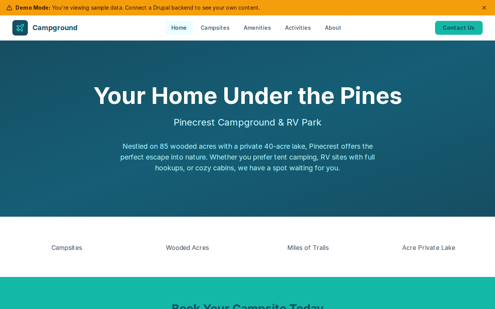

# Decoupled Campground

A campground and RV park website starter template for Decoupled Drupal + Next.js. Built for family campgrounds, RV parks, glamping resorts, and outdoor recreation destinations.



## Features

- **Campsites** - Display tent sites, RV hookups, cabins, and glamping options with rates, amenities, and occupancy details
- **Amenities** - Showcase pools, bathhouses, general stores, and recreation facilities with hours and locations
- **Activities** - Promote hiking, fishing, kayaking, and other outdoor recreation with difficulty levels and seasonal info
- **Modern Design** - Clean, accessible UI optimized for campground and outdoor recreation content

## Quick Start

### 1. Clone the template

```bash
npx degit nextagencyio/decoupled-campground my-campground
cd my-campground
npm install
```

### 2. Run interactive setup

```bash
npm run setup
```

This interactive script will:
- Authenticate with Decoupled.io (opens browser)
- Create a new Drupal space
- Wait for provisioning (~90 seconds)
- Configure your `.env.local` file
- Import sample content

### 3. Start development

```bash
npm run dev
```

Visit [http://localhost:3000](http://localhost:3000)

---

## Manual Setup

If you prefer to run each step manually:

<details>
<summary>Click to expand manual setup steps</summary>

### Authenticate with Decoupled.io

```bash
npx decoupled-cli@latest auth login
```

### Create a Drupal space

```bash
npx decoupled-cli@latest spaces create "My Campground"
```

Note the space ID returned. Wait ~90 seconds for provisioning.

### Configure environment

```bash
npx decoupled-cli@latest spaces env 1234 --write .env.local
```

### Import content

```bash
npm run setup-content
```

This imports:
- Homepage with hero, stats (120 campsites, 85 wooded acres, 12 miles of trails, 40-acre private lake), and reservation CTA
- 4 campsites: Lakefront RV Sites, Woodland Tent Sites, Rustic Pine Cabins, Glamping Safari Tents
- 3 amenities: Heated Swimming Pool & Splash Pad, Camp General Store, Modern Bathhouse & Laundry
- 3 activities: Hiking Trails, Lake Fishing, Kayaking & Canoeing
- 2 static pages: About Pinecrest Campground, Campground Rules & Policies

</details>

## Content Types

### Campsite
- **site_type**: Type taxonomy (Tent Site, RV Full Hookup, RV Partial Hookup, Cabin, Glamping, Group Site)
- **rate**: Nightly rate (e.g., "$65/night")
- **max_occupancy**: Maximum guest count
- **hookups**: Available utility connections (electric, water, sewer, cable, WiFi)
- **features**: Site amenities (lake view, fire ring, picnic table, shade trees, etc.)
- **image**: Photo of the campsite
- **featured**: Whether shown on the homepage

### Amenity
- **amenity_category**: Category taxonomy (Restrooms & Showers, Recreation, Convenience, Pool & Water, Pet Friendly, General Store)
- **location_on_property**: Where the amenity is located
- **hours**: Operating hours
- **included**: Whether included with campsite booking
- **image**: Photo of the amenity

### Activity
- **activity_type**: Type taxonomy (Hiking, Fishing, Swimming, Kayaking, Mountain Biking, Wildlife Viewing, Stargazing)
- **difficulty**: Difficulty level
- **duration**: Typical time required
- **best_season**: Optimal time of year
- **equipment_provided**: Whether gear is available for rent or included
- **image**: Photo of the activity

### Homepage
- **hero_title**: Main headline (e.g., "Your Home Under the Pines")
- **hero_subtitle**: Tagline (e.g., "Pinecrest Campground & RV Park")
- **hero_description**: Welcome message
- **stats_items**: Key statistics (campsites, acres, trails, lake size)
- **featured_items_title**: Section heading for featured campsites
- **cta_title / cta_description**: Reservation call-to-action block

### Basic Page
- General-purpose static content pages (About, Rules & Policies, etc.)

## Customization

### Colors & Branding
Edit `tailwind.config.js` to customize colors, fonts, and spacing.

### Content Structure
Modify `data/campground-content.json` to add or change content types and sample content.

### Components
React components are in `app/components/`. Update them to match your design needs.

## Demo Mode

Demo mode allows you to showcase the application without connecting to a Drupal backend.

### Enable Demo Mode

```bash
NEXT_PUBLIC_DEMO_MODE=true
```

### Removing Demo Mode

1. Delete `lib/demo-mode.ts`
2. Delete `data/mock/` directory
3. Delete `app/components/DemoModeBanner.tsx`
4. Remove `DemoModeBanner` from `app/layout.tsx`
5. Remove demo mode checks from `app/api/graphql/route.ts`

## Deployment

### Vercel (Recommended)
[](https://vercel.com/new/clone?repository-url=https://github.com/nextagencyio/decoupled-campground)

### Other Platforms
Works with any Node.js hosting platform that supports Next.js.

## Documentation

- [Decoupled.io Docs](https://www.decoupled.io/docs)
- [Next.js Documentation](https://nextjs.org/docs)
- [Drupal GraphQL](https://www.decoupled.io/docs/graphql)

## License

MIT
